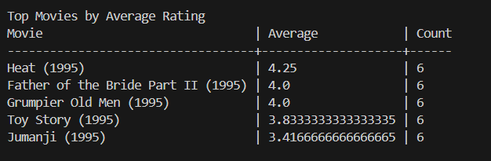
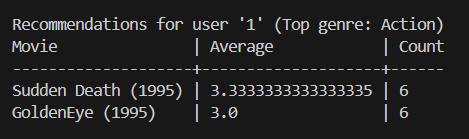

# Movie Recommender System

## Overview
Built a Python-based movie recommendation system that analyzes user ratings and movie metadata to generate personalized recommendations and popularity rankings.

The system processes structured datasets of movies and user ratings, computes statistics, and provides insights such as top movies, genre trends, and user-specific recommendations.

---

## Features
- Top N Movies by Average Rating  
- Top Movies Within a Genre  
- Genre Popularity (based on average movie ratings)  
- User’s Most Preferred Genre  
- Personalized Movie Recommendations  
- Command-Line Interface (CLI) for interactive testing  

---

## Tech Stack
- Python 3.12  
- Standard Library Only (no external dependencies)  
- File I/O & Data Parsing  
- Algorithmic Sorting & Ranking  

---

## Key Implementation Details
- Robust file parsing with validation for malformed data  
- Handles edge cases such as:
  - Duplicate entries  
  - Invalid ratings  
  - Unknown movies in ratings dataset  
- Deterministic ranking system using tie-breaking rules  
- Case-sensitive and case-insensitive handling where appropriate  
- Modular function-based design (no classes)  

---

## Testing
- Automated test suite with 14 test cases  
- Covers:
  - Edge cases  
  - Tie-breaking logic  
  - Invalid input handling  
  - Recommendation correctness  
- Achieved **100% pass rate (14/14 tests)**

---

## Demo

### Top Movies by Average Rating



### Personalized Recommendations



---

## How to Run

```bash
python movie_recommender.py


